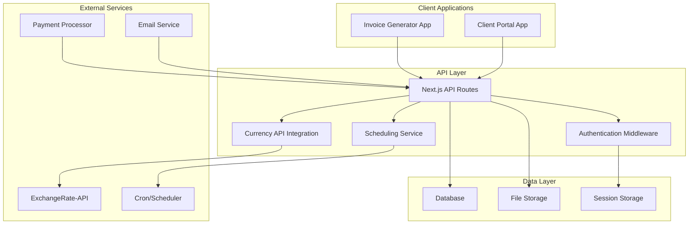

# Design Document

## Overview

This design document outlines the technical architecture for enhancing the existing Next.js invoice generator with multi-currency support, recurring invoices, and a client portal. The solution builds upon the current tech stack (Next.js 15, React 19, Zustand, TailwindCSS, React-PDF) while introducing new components for currency management, scheduling, authentication, and client-facing features.

## Architecture

### Current Architecture Analysis
- **Frontend**: Next.js 15 with React 19, TailwindCSS for styling
- **State Management**: Zustand with persistence
- **PDF Generation**: @react-pdf/renderer
- **UI Components**: Radix UI primitives with custom components
- **Data Flow**: Client-side state management with local persistence

### Enhanced Architecture



## Components and Interfaces

### 1. Enhanced Data Models

#### Currency Support
```typescript
interface Currency {
  code: string; // ISO 4217 currency code
  symbol: string;
  name: string;
  decimalPlaces: number;
}

interface ExchangeRate {
  baseCurrency: string;
  targetCurrency: string;
  rate: number;
  timestamp: Date;
  source: string;
}

interface CurrencyAmount {
  amount: number;
  currency: string;
  exchangeRate?: number;
  baseAmount?: number; // Amount in base currency
}
```

#### Enhanced Invoice Model
```typescript
interface EnhancedInvoice extends InvoiceData {
  id: string;
  currency: Currency;
  exchangeRate?: ExchangeRate;
  isRecurring: boolean;
  recurringConfig?: RecurringConfig;
  parentInvoiceId?: string; // For recurring invoices
  status: 'draft' | 'sent' | 'paid' | 'overdue' | 'cancelled';
  paymentStatus: 'unpaid' | 'partial' | 'paid' | 'refunded';
  createdAt: Date;
  updatedAt: Date;
  dueDate: Date;
  paidAt?: Date;
  clientId: string;
}

interface RecurringConfig {
  frequency: 'weekly' | 'monthly' | 'quarterly' | 'yearly';
  interval: number; // Every X weeks/months/etc
  startDate: Date;
  endDate?: Date;
  maxOccurrences?: number;
  nextGenerationDate: Date;
  isActive: boolean;
}
```

#### Client Portal Models
```typescript
interface ClientUser {
  id: string;
  email: string;
  passwordHash: string;
  name: string;
  company?: string;
  isVerified: boolean;
  createdAt: Date;
  lastLoginAt?: Date;
  resetToken?: string;
  resetTokenExpiry?: Date;
}

interface Payment {
  id: string;
  invoiceId: string;
  clientId: string;
  amount: CurrencyAmount;
  paymentMethod: 'card' | 'bank_transfer' | 'paypal' | 'other';
  transactionId: string;
  status: 'pending' | 'completed' | 'failed' | 'refunded';
  processedAt: Date;
  refundedAt?: Date;
  refundAmount?: number;
}
```

### 2. Currency Management Components

#### CurrencySelector Component
```typescript
interface CurrencySelector {
  selectedCurrency: Currency;
  onCurrencyChange: (currency: Currency) => void;
  supportedCurrencies: Currency[];
  showExchangeRate?: boolean;
}
```

#### CurrencyConverter Service
```typescript
interface CurrencyConverterService {
  getSupportedCurrencies(): Currency[];
  getExchangeRate(from: string, to: string): Promise<ExchangeRate>;
  convertAmount(amount: number, from: string, to: string): Promise<CurrencyAmount>;
  getCachedRates(): ExchangeRate[];
  refreshRates(): Promise<void>;
}
```

### 3. Recurring Invoice Components

#### RecurringInvoiceForm Component
```typescript
interface RecurringInvoiceForm {
  config: RecurringConfig;
  onConfigChange: (config: RecurringConfig) => void;
  onSave: () => void;
  onCancel: () => void;
}
```

#### RecurringInvoiceManager Service
```typescript
interface RecurringInvoiceManager {
  createRecurringInvoice(invoice: EnhancedInvoice, config: RecurringConfig): Promise<string>;
  updateRecurringConfig(invoiceId: string, config: RecurringConfig): Promise<void>;
  cancelRecurring(invoiceId: string): Promise<void>;
  getRecurringInvoices(): Promise<EnhancedInvoice[]>;
  generateScheduledInvoices(): Promise<EnhancedInvoice[]>;
}
```

### 4. Client Portal Components

#### Authentication Components
```typescript
interface LoginForm {
  onLogin: (email: string, password: string) => Promise<void>;
  onForgotPassword: (email: string) => Promise<void>;
}

interface RegisterForm {
  onRegister: (userData: Partial<ClientUser>) => Promise<void>;
}

interface PasswordResetForm {
  token: string;
  onResetPassword: (newPassword: string) => Promise<void>;
}
```

#### Client Dashboard Components
```typescript
interface ClientDashboard {
  invoices: EnhancedInvoice[];
  payments: Payment[];
  totalOutstanding: CurrencyAmount;
  recentActivity: Activity[];
}

interface InvoiceList {
  invoices: EnhancedInvoice[];
  onPayInvoice: (invoiceId: string) => void;
  onDownloadPDF: (invoiceId: string) => void;
  filters: InvoiceFilters;
  onFilterChange: (filters: InvoiceFilters) => void;
}

interface PaymentHistory {
  payments: Payment[];
  onExportData: (format: 'csv' | 'pdf') => void;
  dateRange: DateRange;
  onDateRangeChange: (range: DateRange) => void;
}
```

## Data Models

### Database Schema Design

#### Invoices Table
```sql
CREATE TABLE invoices (
  id UUID PRIMARY KEY DEFAULT gen_random_uuid(),
  invoice_number VARCHAR(50) NOT NULL,
  client_id UUID NOT NULL,
  business_data JSONB NOT NULL,
  client_data JSONB NOT NULL,
  line_items JSONB NOT NULL,
  currency_code VARCHAR(3) NOT NULL,
  exchange_rate DECIMAL(10,6),
  subtotal DECIMAL(12,2) NOT NULL,
  tax_amount DECIMAL(12,2) NOT NULL,
  total_amount DECIMAL(12,2) NOT NULL,
  status VARCHAR(20) NOT NULL DEFAULT 'draft',
  payment_status VARCHAR(20) NOT NULL DEFAULT 'unpaid',
  is_recurring BOOLEAN DEFAULT FALSE,
  recurring_config JSONB,
  parent_invoice_id UUID,
  invoice_date DATE NOT NULL,
  due_date DATE NOT NULL,
  created_at TIMESTAMP DEFAULT NOW(),
  updated_at TIMESTAMP DEFAULT NOW(),
  paid_at TIMESTAMP,
  
  FOREIGN KEY (client_id) REFERENCES client_users(id),
  FOREIGN KEY (parent_invoice_id) REFERENCES invoices(id)
);
```

#### Client Users Table
```sql
CREATE TABLE client_users (
  id UUID PRIMARY KEY DEFAULT gen_random_uuid(),
  email VARCHAR(255) UNIQUE NOT NULL,
  password_hash VARCHAR(255) NOT NULL,
  name VARCHAR(255) NOT NULL,
  company VARCHAR(255),
  is_verified BOOLEAN DEFAULT FALSE,
  verification_token VARCHAR(255),
  reset_token VARCHAR(255),
  reset_token_expiry TIMESTAMP,
  created_at TIMESTAMP DEFAULT NOW(),
  last_login_at TIMESTAMP
);
```

#### Payments Table
```sql
CREATE TABLE payments (
  id UUID PRIMARY KEY DEFAULT gen_random_uuid(),
  invoice_id UUID NOT NULL,
  client_id UUID NOT NULL,
  amount DECIMAL(12,2) NOT NULL,
  currency_code VARCHAR(3) NOT NULL,
  payment_method VARCHAR(50) NOT NULL,
  transaction_id VARCHAR(255) NOT NULL,
  status VARCHAR(20) NOT NULL DEFAULT 'pending',
  processed_at TIMESTAMP DEFAULT NOW(),
  refunded_at TIMESTAMP,
  refund_amount DECIMAL(12,2),
  
  FOREIGN KEY (invoice_id) REFERENCES invoices(id),
  FOREIGN KEY (client_id) REFERENCES client_users(id)
);
```

#### Exchange Rates Table
```sql
CREATE TABLE exchange_rates (
  id UUID PRIMARY KEY DEFAULT gen_random_uuid(),
  base_currency VARCHAR(3) NOT NULL,
  target_currency VARCHAR(3) NOT NULL,
  rate DECIMAL(10,6) NOT NULL,
  source VARCHAR(50) NOT NULL,
  created_at TIMESTAMP DEFAULT NOW(),
  
  UNIQUE(base_currency, target_currency, DATE(created_at))
);
```

### State Management Updates

#### Enhanced Zustand Store
```typescript
interface EnhancedInvoiceState extends InvoiceState {
  // Currency state
  selectedCurrency: Currency;
  exchangeRates: ExchangeRate[];
  supportedCurrencies: Currency[];
  
  // Recurring invoice state
  recurringConfig: RecurringConfig | null;
  recurringInvoices: EnhancedInvoice[];
  
  // Client portal state (separate store)
  currentClient: ClientUser | null;
  clientInvoices: EnhancedInvoice[];
  clientPayments: Payment[];
  
  // Actions
  setCurrency: (currency: Currency) => void;
  updateExchangeRates: (rates: ExchangeRate[]) => void;
  setRecurringConfig: (config: RecurringConfig) => void;
  saveInvoice: (invoice: EnhancedInvoice) => Promise<void>;
}
```

## Error Handling

### Error Types and Handling Strategy

#### Currency-Related Errors
```typescript
class CurrencyError extends Error {
  constructor(message: string, public code: string) {
    super(message);
    this.name = 'CurrencyError';
  }
}

// Error codes:
// CURRENCY_API_UNAVAILABLE - External API is down
// INVALID_CURRENCY_CODE - Unsupported currency
// EXCHANGE_RATE_STALE - Rates are too old
// CONVERSION_FAILED - Mathematical conversion error
```

#### Authentication Errors
```typescript
class AuthError extends Error {
  constructor(message: string, public code: string) {
    super(message);
    this.name = 'AuthError';
  }
}

// Error codes:
// INVALID_CREDENTIALS - Wrong email/password
// ACCOUNT_LOCKED - Too many failed attempts
// TOKEN_EXPIRED - Session or reset token expired
// EMAIL_NOT_VERIFIED - Account not verified
```

#### Payment Errors
```typescript
class PaymentError extends Error {
  constructor(message: string, public code: string, public retryable: boolean = false) {
    super(message);
    this.name = 'PaymentError';
  }
}

// Error codes:
// PAYMENT_DECLINED - Card declined
// INSUFFICIENT_FUNDS - Not enough balance
// PAYMENT_PROCESSOR_ERROR - External service error
// INVALID_PAYMENT_METHOD - Unsupported payment type
```

### Error Handling Components
```typescript
interface ErrorBoundary {
  fallback: React.ComponentType<{error: Error}>;
  onError?: (error: Error, errorInfo: ErrorInfo) => void;
}

interface ErrorDisplay {
  error: Error;
  onRetry?: () => void;
  onDismiss?: () => void;
}
```

## Testing Strategy

### Unit Testing
- **Currency Conversion Logic**: Test exchange rate calculations, currency formatting
- **Recurring Invoice Logic**: Test schedule generation, date calculations
- **Authentication Logic**: Test password hashing, token generation
- **Payment Processing**: Test amount calculations, status transitions

### Integration Testing
- **API Endpoints**: Test all CRUD operations for invoices, clients, payments
- **External Services**: Test currency API integration with mocked responses
- **Database Operations**: Test data persistence and retrieval
- **Email Services**: Test notification sending

### End-to-End Testing
- **Invoice Creation Flow**: Complete invoice creation with currency selection
- **Recurring Invoice Setup**: Create and verify recurring invoice generation
- **Client Portal Flow**: Registration, login, invoice viewing, payment processing
- **Multi-Currency Scenarios**: Create invoices in different currencies and verify calculations

### Testing Tools and Framework
```typescript
// Jest configuration for unit tests
// Cypress or Playwright for E2E tests
// MSW (Mock Service Worker) for API mocking
// Testing Library for component testing

interface TestUtils {
  createMockInvoice: (overrides?: Partial<EnhancedInvoice>) => EnhancedInvoice;
  createMockClient: (overrides?: Partial<ClientUser>) => ClientUser;
  mockCurrencyAPI: (rates: ExchangeRate[]) => void;
  mockPaymentProcessor: (responses: PaymentResponse[]) => void;
}
```

### Performance Testing
- **Currency API Response Times**: Ensure sub-second response times
- **Recurring Invoice Generation**: Test bulk generation performance
- **Client Portal Load Times**: Optimize for mobile and slow connections
- **PDF Generation**: Test generation time with large invoices

## Security Considerations

### Authentication and Authorization
- **Password Security**: bcrypt with minimum 12 rounds
- **Session Management**: JWT tokens with 24-hour expiry
- **Rate Limiting**: Implement on login, password reset, and payment endpoints
- **CSRF Protection**: Use Next.js built-in CSRF protection

### Data Protection
- **Encryption at Rest**: Encrypt sensitive fields in database
- **Encryption in Transit**: HTTPS only, secure headers
- **PII Handling**: Minimal data collection, secure deletion
- **Payment Data**: PCI DSS compliance, tokenization

### API Security
- **Input Validation**: Strict validation on all endpoints
- **SQL Injection Prevention**: Use parameterized queries
- **XSS Prevention**: Sanitize all user inputs
- **CORS Configuration**: Restrict to known domains

### Client Portal Security
- **Account Verification**: Email verification required
- **Password Requirements**: Minimum 8 characters, complexity rules
- **Session Security**: Secure cookies, automatic logout
- **Data Access Control**: Clients can only access their own data

## Implementation Phases

### Phase 1: Multi-Currency Foundation
1. Update data models to support currency
2. Integrate ExchangeRate-API
3. Create currency selection UI
4. Update calculation logic
5. Test currency conversion accuracy

### Phase 2: Recurring Invoices
1. Design recurring invoice data structure
2. Create scheduling UI components
3. Implement cron job system
4. Build recurring invoice management
5. Test schedule generation

### Phase 3: Client Portal Authentication
1. Set up authentication system
2. Create login/register components
3. Implement password reset flow
4. Add session management
5. Test security measures

### Phase 4: Client Portal Features
1. Build client dashboard
2. Create invoice viewing interface
3. Implement payment processing
4. Add payment history
5. Test end-to-end flows

### Phase 5: Integration and Polish
1. Integrate all features
2. Comprehensive testing
3. Performance optimization
4. Security audit
5. Documentation completion